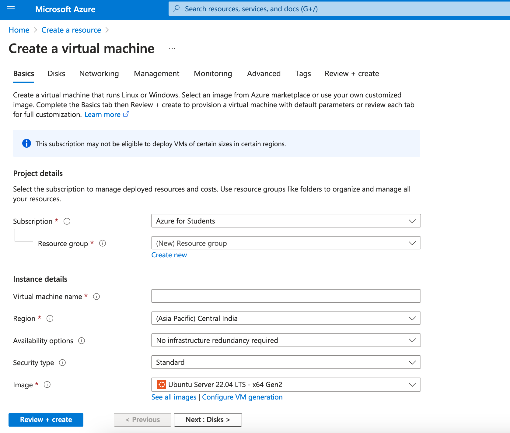

## Day 0 & 1
Both day 0 and day 1 tasks were released on the same day, and can also be completed the same day. Day 0 was about creating a virtual machine (VM) in cloud (or locally if no cloud credits), and day 1 was about getting familiar with the VM. Since I had access to my student account, I used Azure for Students to get $100 credits.

### Signing up in Azure (for students)
TBD

### Creating Azure VM
To create an azure VM, first go to Azure portal home: https://portal.azure.com/.

Find + icon with 'Create a resource' label, and click it. This is to create resources (for e.g. the VM, network interface, etc.).
	

You can either directly select the 'Virtual machine' service or pick one of the Ubuntu server versions, and click 'Create'. You can go with Ubuntu Server 22.04 LTS as it is the latest version.
	

The next step is for adding details for creating a VM.
#### Basics

- **Resource group** (for managing similar resources together): Either 'Create new' or select one from the drop-down list if you already have one. You can name the resource group anything, for e.g. `linux-upskill-challenge`.
- **Virtual machine name**: Enter a name for your VM, for e.g. `linux-upskill-challenge-vm`.
- **Region**: There are numerous regions around the world to select from. You can select the one nearest to you as it will probably be only you who will use it. For me Central India is near, so I selected that.
- **Image**: Choose an image (or OS) for your VM.
- **Size**: Select a VM size suitable for you. If you want to see more sizes, click 'See all sizes'. Since I won't be needing this VM for anything significant, I selected the cheapest one: `Standard_B1ls`, having 1 vcpu - 0.5 GiB memory, and costs $4.09/month.
- **Authentication type**: You can leave 'SSH public key' selected.
- **Username**: Your user's username in VM.

You can leave rest of the fields to the values populated by default. Then click 'Next: Disks'.


#### Disks
- **OS disk type**: Select the disk type for the VM. I chose 'Standard SSD' as I won't have heavy load and don't need high reliability.
- **Delete with VM**: You can select this if you want the disk to be deleted when you delete the VM.

#### Networking
- **Delete public IP and NIC when VM is deleted**: You may want to select this option to make sure that the associated public IP and NIC are deleted when you delete the VM.

Now you can directly skip to 'Review + create', or go through other tabs like Management, Monitoring, etc. yourself.

#### Review + create
Review all the details for the VM in this step. When you are done, click 'Create'. You will be presented a dialog to 'Create new key pair', where you have to click 'Download private key and create resource'. Then you need to save a file with name ending in `.pem`. This file is your private key file. You use this private key file to SSH into your Azure VM.


The deployment will also begin, which will create the VM as well as other resources. This will take some minutes to complete. Once it is complete, go to the resource.


### SSH into your VM
You may move your SSH private key file into `~/.ssh` directory, if it doesn't exist, create it yourself manually. This directory is where the SSH keys are usually stored for the current user. If you want to, you can rename the private key file to anything to your liking, for e.g. `azure-vm`. *Note that the corresponding public key associated with this private key is kept automatically in the Azure VM.*

First grab the public IP address of your VM from the 'Overview' page. Then to SSH into your VM, adapt the following to your situation:
```sh
ssh -i <path-to-private-key-file> <username>@<public-key>

# for e.g.
ssh -i ~/.ssh/azure-vm jarp0l@1.2.3.4
```

The `-i` flag is used to specify the identity file (or the file with your private key). I have assumed my public IP as `1.2.3.4`.

You should have noticed the error which reads something like: `unprotected private key file` / `bad permissions`. That is because the permission of the private key file is too open for users other than the owner. You can modify its permission to make it just `read-only` for the owner. You may also experiment with different permission bits and come up with the one that doesn't give error.

To make the file `read-only` for the owner (user) of the file, use this command:
```sh
sudo chmod 400 <path-to-private-key-file>

# e.g.:
sudo chmod 400 ~/.ssh/azure-vm
```

Now if you SSH using the private key file, you will be logged in successfully.

If you are SSHing the first time, you will get a message like the following:
```
The authenticity of host '1.2.3.4 (1.2.3.4)' can't be established.
ED25519 key fingerprint is SHA256:X/+abc...xyz.
This key is not known by any other names
Are you sure you want to continue connecting (yes/no/[fingerprint])? yes
```
Enter 'yes' and continue in this case.

#### Avoid having to add the identity file every time
You will have to add the identity file path every time you want to SSH. To avoid having to repeat this every time, add the following lines to `~/.ssh/config` file (if this file doesn't exist, create it yourself):
```sh
Host <public-ip>
  AddKeysToAgent yes
  IdentityFile <path-to-public-key>
```

e.g.:
```sh
Host 1.2.3.4
  AddKeysToAgent yes
  IdentityFile ~/.ssh/azure-vm
```

Now you can just ssh with: `ssh <username>@<public-ip>`.


### Running various commands
Now that you have logged in to your VM, you can try any command to get the feel of the cloud server. The first thing you may want to try is updating/upgrading the server:
```sh
sudo apt update && sudo apt upgrade -y
```

To reboot the machine:
```sh
sudo reboot now
```
(This will log you out immediately, and you'll have to wait to log in again before the machine boots up.)


If you don't need the VM and want to shut it down to avoid spending your credits, you can do that with:
```sh
sudo poweroff
```

(Note: I have deviated somewhat from the day 0 and day 1 tasks, but still is similar to the objectives of the days.)